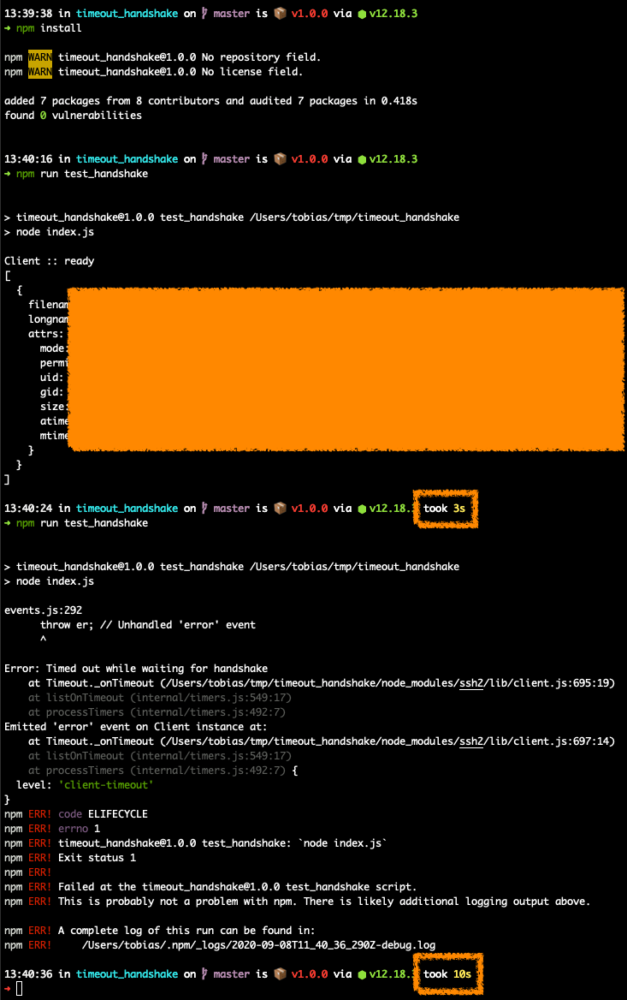

Run
===
```
export TIMEOUT_HANDSHAKE_HOST=<host>
export TIMEOUT_HANDSHAKE_USER=<user>
export TIMEOUT_HANDSHAKE_PASS=<pass>
export TIMEOUT_HANDSHAKE_PATH=<path> (optional)

npm install
npm run test_handshake
```

Reproduce handshake timeout
===
Try out different settings for readyTimeout (ms) and retry a few times to trigger the error.

It seems like different times of the day, gives different results. Sometimes it fails rather consistenly, other times it works every time, even with low readyTimeout (e.g. 1000 ms)

Output example
===

